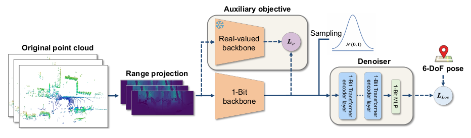
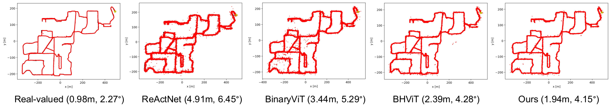
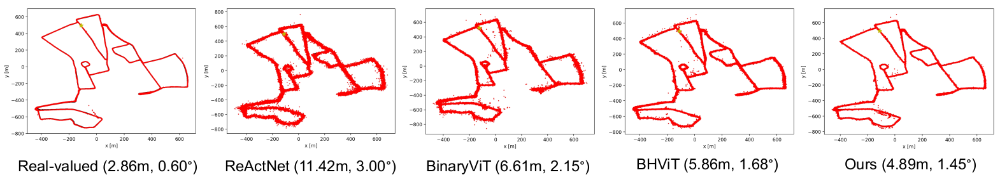

# BiLoc: Learning 1-Bit LiDAR-based Localization with Auxiliary Objective

This repository contains the official implementation of **BiLoc**.

BiLoc is designed for always-on LiDAR localization on resource-constrained
platforms. It constrains both weights and activations to 1 bit, and uses a
training-only auxiliary objective to improve the binary encoder with guidance
from an offline real-valued teacher. The auxiliary objective is removed at
inference time, so it adds no deployment overhead.



## Results

The paper evaluates BiLoc on Oxford Radar RobotCar and NCLT using mean position
error and mean orientation error.

| Dataset | Method | Bits | Average error |
| --- | --- | --- | --- |
| Oxford | BiLoc | 1 | 7.56 m / 1.91 deg |
| NCLT | BiLoc | 1 | 3.14 m / 4.36 deg |

## Qualitative Visualization





## Repository Layout

This release keeps only the code needed to train and evaluate BiLoc, plus the
runtime dependencies required by the model.

```text
BiLoc/
├── biloc/                 # BiLoc training, KD training, and evaluation code
├── BHViT/                 # Minimal BHViT backbone dependency used by BiLoc
├── diffoc_full_precision/ # Full-precision DiffLoc teacher code for KD training
├── img/                   # README figures
├── LICENSE
└── README.md
```

The release package keeps the BiLoc implementation and runtime dependencies only.
Experiment logs, checkpoints, TensorBoard events, deployment helper copies, and
local cache files are not included.

## Environment

The experiments in the paper were run on a single NVIDIA RTX 5090 GPU.

Verified local environment:

- Python: 3.9
- PyTorch: 2.8.0+cu128
- CUDA runtime used by PyTorch: 12.8

Key Python packages in the tested environment:

| Package | Version |
| --- | --- |
| `omegaconf` | 2.3.0 |
| `hydra-core` | 1.3.2 |
| `einops` | 0.8.1 |
| `tensorboardX` | 2.6.4 |
| `timm` | 1.0.22 |
| `opencv-python` | 4.12.0 |
| `transforms3d` | 0.4.2 |
| `open3d` | 0.19.0 |
| `h5py` | 3.14.0 |
| `numpy` | 2.0.1 |

Activate the environment before running training or evaluation:

```bash
conda activate biloc
cd biloc
```

The inherited `install.sh` is kept for reference, but it may not match the RTX
5090 / CUDA 12.8 setup. Prefer using the `biloc` conda environment or
recreating an equivalent PyTorch 2.8 + CUDA 12.8 environment.

## Data Preparation

BiLoc uses LiDAR data from Oxford Radar RobotCar and NCLT.

The configs expect this structure by default:

```text
data_root/
├── Oxford/
│   ├── Oxford_pose_stats.txt
│   ├── train_split.txt
│   ├── valid_split.txt
│   └── ...
└── NCLT/
    ├── NCLT_pose_stats.txt
    ├── train_split.txt
    ├── valid_split.txt
    └── ...
```

The current configs use:

```yaml
train:
  dataroot: ../data
  steps: 3
  skip: 2
  image_size: [32, 512]
```

Change `train.dataroot` in `cfgs/oxford.yaml` or `cfgs/nclt.yaml` to your local
dataset root.

Preprocessing helpers are in:

```text
biloc/preprocess/
```

## Training

Run all main commands from:

```bash
cd biloc
```

Train the 1-bit student without the auxiliary objective:

```bash
python train.py
```

Train BiLoc with the auxiliary objective:

```bash
python train_kd.py
```

Important config fields:

```yaml
ckpt: path/to/student_checkpoint.pth
exp_dir: log/your_experiment

train:
  dataset: Oxford       # Oxford or NCLT
  dataroot: path/to/data_root
  batch_size: 40
  epochs: 120

KD:
  teacher_cfg: ../diffoc_full_precision/cfgs/oxford.yaml
  teacher_ckpt: path/to/full_precision_teacher.pth
  weight: 0.8
  struct_weight: 0.05
  loss_type: entropy
  struct_loss_type: lckt
```

The paper uses lambda1 = 0.80 and lambda2 = 0.05 for the auxiliary objective.
The code maps these to `KD.weight` and `KD.struct_weight`.

Some entry scripts currently load a config at the bottom of the file, for
example:

```python
conf = OmegaConf.load("cfgs/nclt.yaml")
```

Switch this line to `cfgs/oxford.yaml` or `cfgs/nclt.yaml` before launching a
run.

## Evaluation

Set `ckpt`, `train.dataset`, `train.dataroot`, and `exp_dir` in the selected
config, then run:

```bash
python test.py
```

The evaluator writes:

```text
error_t.txt
error_q.txt
pred_t.txt
gt_t.txt
pred_q.txt
gt_q.txt
trajectory.png
```

under `cfg.exp_dir`.

## Model Zoo

Oxford BiLoc student checkpoint will be released publicly.

Recommended release layout:

```text
checkpoints/
└── biloc_oxford.pth
```


## Acknowledgements

This code builds on DiffLoc and BHViT components used
by the BiLoc model. Please follow the licenses and citation requirements of
those projects when using the corresponding components.

## Citation

If this repository is useful for your research, please cite:

```bibtex
@inproceedings{yin2026biloc,
  title={Learning 1-Bit LiDAR-based Localization with Auxiliary Objective},
  author={Yin, Kaijie and Zhang, Zhiyuan and Gao, Tian and Zhu, Wentao and Xu, Cheng-Zhong and Kong, Hui},
  booktitle={European Conference on Computer Vision},
  year={2026}
}
```
